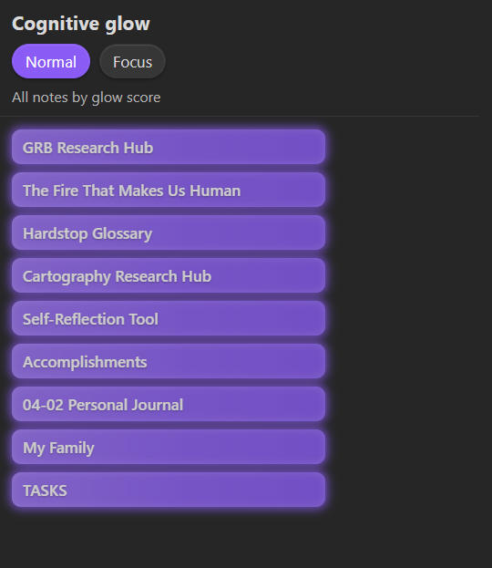

# Cognitive Glow

An Obsidian plugin that surfaces the notes you actually use. Notes you actively visit glow brighter in a ranked sidebar; ones you haven't touched fade out. No tags, no manual curation — just open notes and let the glow tell you where your attention lives.



## Why

Most note-taking setups bury active work under search results and folder hierarchies. Cognitive Glow gives you a persistent, at-a-glance view of what matters right now, ranked by a blend of recency and visit frequency.

## Features

- **Visual glow** — each note gets a luminous bar proportional to its score. High-activity notes shine; old ones dim.
- **Normal and Focus modes** — Normal shows your full ranked list; Focus narrows it to your top N.
- **Dwell-time gating** — visits only count after a configurable minimum open time (default 30 s), so quick flick-throughs don't inflate scores.
- **Folder scope** — restrict tracking to specific folders, or exclude folders like `Templates/` or `Archive/`.
- **Sidebar placement** — left or right, whichever fits your layout.
- **Ribbon shortcut** — sparkles icon in the ribbon opens the panel.

## Installation

### From community plugins (pending review)

Search for **Cognitive Glow** in Settings > Community plugins.

### Manual

```bash
npm install
npm run build
```

Copy `manifest.json`, `main.js`, and `styles.css` into `.obsidian/plugins/cognitive-glow/`, then enable in Settings > Community plugins.

## Usage

1. Open notes normally — Cognitive Glow tracks visits automatically.
2. Open the panel from the ribbon (sparkles icon) or command palette (`Open sidebar`).
3. Toggle between **Normal** and **Focus** with the header buttons.
4. Click any row to jump to that note.

## Settings

### Display

| Setting | Default | Description |
|---|---|---|
| Glow fades after | 3 days | How quickly a note loses glow. Presets: 1 day / 3 days / 1 week / 1 month. |
| Max notes in focus mode | 5 | Top N notes shown in focus mode. |
| Hide faded notes | Off | Only show notes above a minimum score. |
| Sidebar placement | Right | Which sidebar hosts the panel. |

### Tracking

| Setting | Default | Description |
|---|---|---|
| Minimum open time | 30 s | A note must stay open this long to count as a visit. Set to 0 for instant tracking. |
| Tracked folders | _(all)_ | Only track notes in these folders. One path per line. |
| Excluded folders | _(none)_ | Never track notes in these folders. Takes priority over inclusions. |

### Advanced

| Setting | Default | Description |
|---|---|---|
| Recency weight | 0.6 | Contribution of recent activity to the score (0-1). |
| Frequency weight | 0.4 | Contribution of visit count to the score (0-1). |
| Manual pin weight | 0 | Boost for manually pinned notes (0-1). |
| Frequency scale | 20 | Opens treated as "max frequency". |
| Max tracked notes | 3000 | Memory cap. 0 = unlimited. |
| Recency decay (ms) | 259200000 | Raw exponential decay constant. Overrides dropdown. |

## Commands

| Command | Description |
|---|---|
| Open sidebar | Opens or reveals the Cognitive Glow panel. |
| Dump glow scores to console | Logs the top 20 notes by score (dev console). |
| Show persisted data (JSON) | Opens a modal with the full saved payload. |

## How scoring works

```
recency   = exp(-(now - lastOpened) / tauRecencyMs)
frequency = log(1 + hitCount) / log(1 + hitCountMaxScale)
gravity   = manualGravity  (0 if unset)

glowScore = wRecency * recency + wFrequency * frequency + wGravity * gravity
```

Weights are normalized if their sum exceeds 1. See [`SPEC.md`](SPEC.md) for full implementation details.

## Development

```bash
npm install          # install dependencies
npm run build        # compile plugin
npm run dev          # watch mode
npm run lint         # eslint (Obsidian rules)
npm run test         # unit tests
```

## Data

Stored in `.obsidian/plugins/cognitive-glow/data.json`. No network requests, no telemetry.

## License

[MIT](LICENSE)
